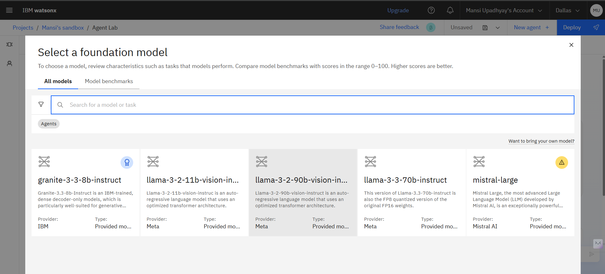
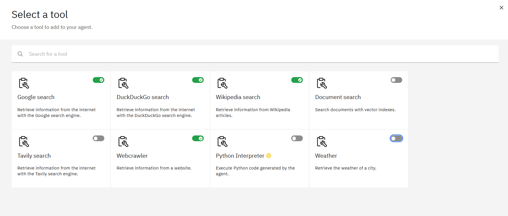
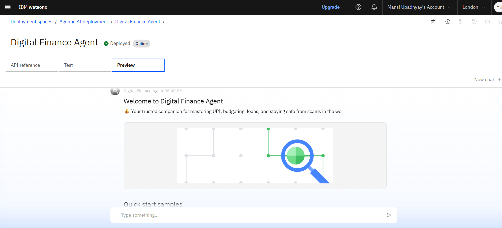

# 🤖 Digital Financial Literacy AI Agent

Empowering Every Citizen with Safe, Smart, and Inclusive Financial Knowledge  
Built using IBM Watsonx, Granite, RAG, and multilingual AI — submitted as part of the IBM-AICTE SkillsBuild Internship Project

---

  

---

## 🔍 Problem Statement

Millions of people, especially in rural or non-English-speaking regions, face difficulty understanding digital financial tools like UPI, interest rates, loans, or scams.

### 📉 Manual awareness programs:
- Are limited in reach  
- Cannot adapt to each user's needs  
- Often miss out on multilingual support  

---

## ✅ Proposed Solution

An AI-powered *Digital Financial Literacy Agent* that:
- 🧠 Retrieves verified content from *RBI, **NPCI, and Govt. portals using **RAG (Retrieval-Augmented Generation)*
- 🌐 Provides *multilingual, **simple, and **personalized* financial advice
- 🛡 Prevents *online scams* and promotes *safe digital finance practices*

---

## 🧠 Key Features

- 🔍 *Smart Retrieval* – Context-aware financial answers from trusted sources  
- 🗣 *Multilingual Support* – Understands Hindi and regional languages  
- 🚫 *Fraud Alerts* – UPI scam education, phishing protection  
- 💰 *Budget & Saving Guidance* – Personalized suggestions for financial planning  
- 🔁 *Auto-updating Knowledge Base* – Always in sync with RBI/UPI updates  

---

## 🛠 Tech Stack

| Technology | Purpose |
|------------|---------|
| 🧠 IBM Watsonx Agent Lab | Agent creation & deployment |
| 🔤 IBM Granite Foundation Model | Natural Language + Retrieval |
| 📚 RAG (Retrieval-Augmented Generation) | Trusted content delivery |
| 🗃 Git & GitHub | Version control & collaboration |

---

## 🚀 Wow Features

✅ Personalized answers (e.g., safe loan for ₹10k/month earner)  
🌐 Multilingual support for regional inclusivity  
⚠️ Scam alerts for fake UPI links, fraud apps  
💡 Simplifies financial terms for first-time users  
📱 Works even on low-end devices, no app needed  
🔁 Automatically updated with new government rules  

---

## 🖼 Demo Walkthrough

| Step | Screenshot |
|------|------------|
| ✅ *Step 1: Setup Agent*         |  |
| ✅ *Step 2: Choose Model*        |  |
| ✅ *Step 3: Sample Prompts*      |  |
| ✅ *Step 4: Framework Setup*     |  |
| ✅ *Step 5: Agent Instructions*  |  |
| ✅ *Step 6: Add Tools*           |  |
| ✅ *Step 7: Preview Agent*       |  |
| ✅ *Step 8: Deploy Agent*        |  |
---

## 🌟 User Interaction Showcase

Real usage examples from the deployed AI Agent:

- 👤 **User 1:** *"How do I use UPI?"*  
  👉 *Agent explains UPI in easy steps.*  
  

- 👤 **User 2:** *"How to manage my ₹20,000 income?"*  
  👉 *Gives a budget breakdown: ₹6k rent, ₹5k food, ₹3k savings, etc.*  
  

- 👤 **User 3:** *"Any tips for student saving?"*  
  👉 *Agent suggests budgeting apps, thrift ideas, discounts.*  
  

- 👤 **User 4:** *"Mujhe Hindi me batayein" (Tell me in Hindi)*  
  👉 *Agent answers in Hindi using official RBI info.*  
  

  ---

## 🎥 Demo Video – Watch it in Action!

🔗 Click below to see the full working AI Agent in action:

⬆️ Click the image above to watch the full demo video on Google Drive

---

- 🤖 *WhatsApp & Chatbot Integration* – Wider reach to mobile users  
- 🖼 *Image + Text Query Support* – Understand screenshots of scam messages  
- 🔐 *Fraud Pattern Detection* – ML-based phishing/spam detection  
- 📱 *Offline Mobile App* – Low-bandwidth, rural support  
- 🧠 *Region-Specific Fine-tuning* – Customize for local needs & languages  

---

## 🔗 Useful Links

- 🌐 [IBM Watsonx.ai](https://www.ibm.com/products/watsonx-ai) – AI Platform  
- 💡 [NPCI – UPI Overview](https://www.npci.org.in/what-we-do/upi/product-overview) – UPI Info  
- 🏦 [RBI Financial Literacy](https://www.rbi.org.in/commonperson/English/Scripts/FinancialEducation.aspx) – Government Source  
- 📁 [GitHub Repository](https://github.com/Mansi-Upadhyay-12/Digital-Financial-Literacy-AI-Agent) – Code & Screenshots  

---

## 📄 License

This project is licensed under the [MIT License](LICENSE).

---

## 👤 Author

Made with ❤ by *[Mansi Upadhyay](https://github.com/Mansi-Upadhyay-12)*

